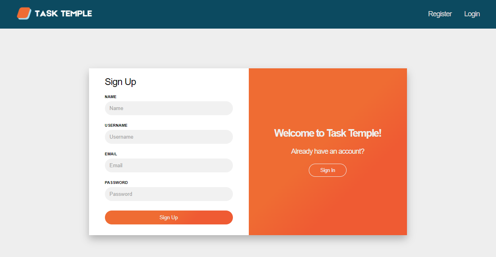

# Task Temple

Task temple is a role based task management application with user authentication where users can mark tasks as completed or pending, while admins can create, edit, delete and also complete tasks.
</br></br>

<p align="center">
    
</p>

## Installation

To install the project, download the zip directly from here or paste this code on the command line:

```
git clone https://github.com/DanielJHV/task-temple.git
```

Run the backend application that will start on http://localhost:8080.</br>
Then, run the frontend application by executing these commands:

```
cd task-temple/frontend
npm install
npm run dev
```

After that, go to http://localhost3000 where the application is running.
</br>

<p align="center">
    
</p>
